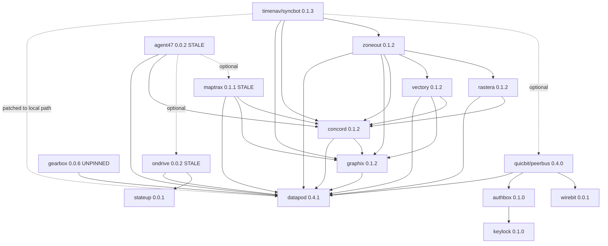

# robolibs — dependency map & release process

How the crates in this directory depend on each other, why version drift breaks
the build, and the order to release things in when it does.

All crates are consumed as **git dependencies pinned to a tag**, not via a cargo
workspace and not from crates.io (`publish = false` everywhere). That single fact
causes most of the pain documented here.

## The failure mode: "multiple different versions of crate `datapod`"

Symptom — dozens of `E0308: mismatched types` errors that look nonsensical:

```
error[E0308]: mismatched types
  --> src/grid.rs:43:24
   |
43 |                 datum: Geo::new(0.0, 0.0, 0.0),
   |                        ^^^^^^^^^^^^^^^^^^^^^^^ expected `vectory::types::Geo`, found `datapod::Geo`
   |
note: there are multiple different versions of crate `datapod` in the dependency graph
```

**Why.** Cargo cannot unify two git dependencies pinned to different tags. If
`zoneout` asks for `datapod` at tag `0.4.1` but `vectory` still asks for tag
`0.4.0`, cargo checks out *both* and compiles *both*. `datapod::Geo` from `0.4.0`
and `datapod::Geo` from `0.4.1` are then genuinely unrelated types to rustc, even
if the source is byte-identical. Every value crossing the boundary fails to typecheck.

Confirm it with:

```sh
cargo tree -i datapod
# error: There are multiple `datapod` packages in your project ...
#   datapod@0.4.0
#   datapod@0.4.1
```

That error text *is* the diagnosis. A healthy tree prints a single version and its
dependents instead.

**The fix is never in your own source code.** Do not try to convert between the two
`Geo` types. Bump the stale siblings to the same tag and release them, bottom-up.

## The graph

Arrows point from a crate to what it depends on. `datapod` is the foundation —
it defines the shared spatial types (`Geo`, `Pose`, `Grid`) that everything else
passes around, which is exactly why a split version of it detonates the build.



Standalone — no robolibs dependencies, never involved in a datapod bump:
`datapod`, `keylock`, `wirebit`, `stateup`, `coreviz`/roboviz, `agrobus`/machbus.

### Release levels

Everything in a level depends only on lower levels, so a level's crates can be
released in any order (or in parallel). Never release out of order — a crate
released before its dependency has a tag will pin the *old* tag and re-split the graph.

| Level | Crates | Depends on |
|---|---|---|
| 0 | `datapod`, `keylock`, `wirebit`, `stateup`, `coreviz`, `agrobus` | nothing |
| 1 | `graphix`, `gearbox`, `ondrive`, `authbox` | datapod / stateup / keylock |
| 2 | `concord`, `quicbit`(peerbus) | + graphix / authbox, wirebit |
| 3 | `vectory`, `rastera`, `maptrax` | + concord |
| 4 | `zoneout`, `agent47` | + vectory, rastera / maptrax, ondrive |
| 5 | `timenav`(syncbot) | + zoneout, peerbus |

`concord` depends on `graphix` — that is the edge that most often gets the order
wrong. `graphix` always goes first.

## Directory name ≠ crate name ≠ repo name

Four packages are checked out under a directory that does not match the crate.
The **git URL uses the crate name**, so `grep` for the directory name and you'll
find nothing.

| Directory | Crate / repo name |
|---|---|
| `agrobus` | `machbus` |
| `coreviz` | `roboviz` |
| `quicbit` | `peerbus` |
| `timenav` | `syncbot` |

So `timenav`'s dependency on `quicbit` reads
`peerbus = { git = "https://codeberg.org/robolibs/peerbus", tag = "0.4.0" }`.

## Procedure for a version bump

Given "crate X released a new tag, everything is broken":

1. **Reproduce and confirm** — `make build`, then `cargo tree -i <crate>` to see the split.
2. **Find every dependent** — from the levels table, or:
   ```sh
   cd /home/bresilla/data/code/robolibs && grep -n 'datapod' */Cargo.toml
   ```
3. **Work bottom-up** through the levels. For each crate, in order:
   - Edit `Cargo.toml`: bump the stale tag *and* the tags of any siblings released
     earlier in this same sweep.
   - `cargo build` — **verify it compiles before releasing.** A release is a push,
     a tag, and a merge to main; do not tag something that doesn't build.
   - `make release TYPE=patch`
4. **Bump the top-level consumer** to all the new tags and build.

Repos must be on `develop` and clean before releasing; `git-rel` refuses otherwise
and `git add -A` sweeps in anything else you left lying around.

### What `make release TYPE=patch` actually does

Wraps `git rel patch` → `/home/bresilla/.dot/.config/profile/functions/git/git-rel`:

1. Asserts branch is `develop`.
2. Bumps the version via `veri` (Cargo.toml, pyproject.toml).
3. Generates CHANGELOG via `git cliff`.
4. `git add -A` && commit `chore(release): prepare for <version>`.
5. Annotated tag, `git push --follow-tags --force`, plus any non-origin remotes.
6. Checks out `main`, merges `develop`, pushes, returns to `develop`.
7. `gh release create` — **always fails here.** These are Codeberg repos, and gh
   only knows GitHub hosts. It's swallowed by `|| true`; the tag and merge already
   landed. Ignore the "none of the git remotes ... point to a known GitHub host"
   line, it is not a failed release.

`TYPE` accepts `patch|minor|major` or an explicit `m.m.p`.

## Known stale / risky state (as of 2026-07-16)

The datapod 0.4.0 → 0.4.1 sweep only covered the `zoneout` branch of the tree
(graphix, concord, vectory, rastera → all `0.1.2`). These were left behind and
will hit the same error the moment they're touched:

- **`timenav`/syncbot — already broken.** Pins `datapod` `0.4.1` but `concord`,
  `graphix`, `zoneout` at `0.1.1`, which pin `datapod` `0.4.0`. Verified split.
  Needs concord/graphix → `0.1.2` and zoneout → its next tag.
- **`maptrax`** — `datapod` `0.4.0`, `concord` `0.1.1`, `graphix` `0.1.1`.
- **`agent47`** — `datapod` `0.4.0`, `concord` `0.1.1`.
- **`ondrive`** — `datapod` `0.4.0`.
- **`gearbox`** — `datapod` with **no tag at all**
  (`datapod = { git = "https://codeberg.org/robolibs/datapod" }`). Floats to the
  default branch, so its resolved version depends on whatever is in `Cargo.lock`
  and silently moves on `cargo update`. Worth pinning to a tag like everything else.
- **`quicbit`/peerbus** — on `datapod` `0.4.1` already, but pins `wirebit` by
  **rev** (`f4b72c4c…`) rather than tag. Fine, just inconsistent with the rest.

Also note `zoneout` itself is still at `0.1.1` and has not been re-released since
its deps were bumped — `timenav` cannot be fixed until it is.
